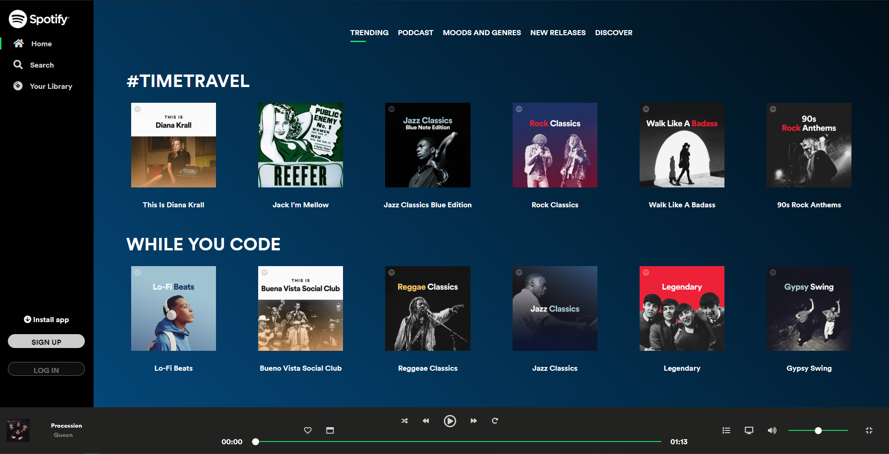

# SPOTIFY UI PROJECT

This project is the first build week project of Strive School to practise our skills on boostrap,css and js.

[Click Here To See Demo](https://spotify.imfast.io/)

### TEAM MEMBERS

- Solomon Ugwuanyi
- Hafeez Oluwasijibomi
- Ubeyt Demir

### LOGIN-PAGE

Login page has options to use login services such as apple and facebook.

[!LOGIN](./screenshots/login.PNG)

### HOME PAGE

Home page contains albums/playlists of user.

### ARTIST PAGE

Artist page is aiming to give information abou artist and showing their discography.

[!ARTIST](./screenshots/artist-details.page.PNG)

### ALBUM PAGE

Album page contains name , songs of album , release date and cover.
Album songs are interactable with player.

[!ALBUM](./screenshots/album-details.PNG)

#### ADDITIONAL FEATURES

Fullscreen Player

[!FullScreen](./screenshots/fs-player.PNG)

[!Fullscreen](./screenshots/mobile-fs.PNG)

Fullscreen Mobile Menu

[!Fullscreen](./screenshots/mobile-menu.PNG)
